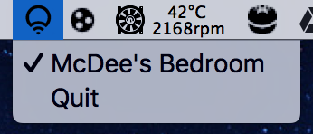

# LifxController

A simple python app that turns your LIFX lights on and off from the OSX menu bar. Supports automated discovery of new lights and updating of their states.

Packaged together as an OSX Application using py2app using the supplied setup.py file.

### Download the latest release [HERE](https://github.com/mitchmcdee/LifxController/releases/download/v0.1-alpha/LifxController.app.zip)!
