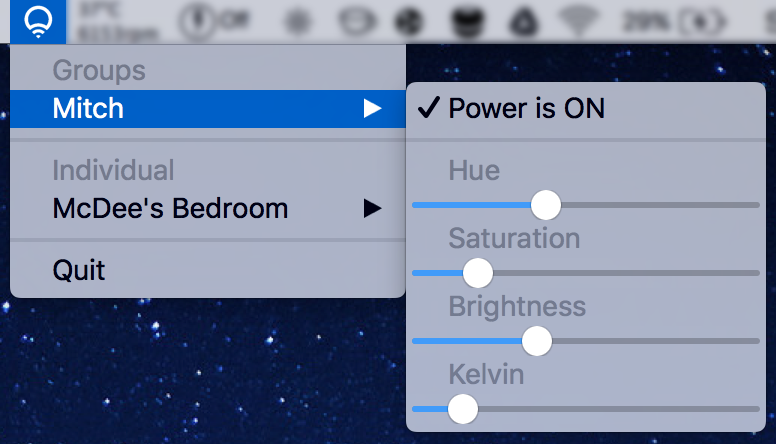

# LifxController

A python app that allows you to control your LIFX lights from the OSX menubar!

Supports:
  - [x] Automatic discovery and updating of lights
  - [x] Toggling power of individual lights
  - [x] Controlling brightness of individual lights
  - [x] Controlling colour of individual lights
  - [ ] Controlling groups
  
Many changes to come, stay tuned!

Packaged together as an OSX Application using py2app using the supplied setup.py file.

# Screenshots

# Download

#### Latest release [HERE](https://github.com/mitchmcdee/LifxController/releases/download/v0.3-beta/LifxController.app.zip)!
All releases [here](https://github.com/mitchmcdee/LifxController/releases)
